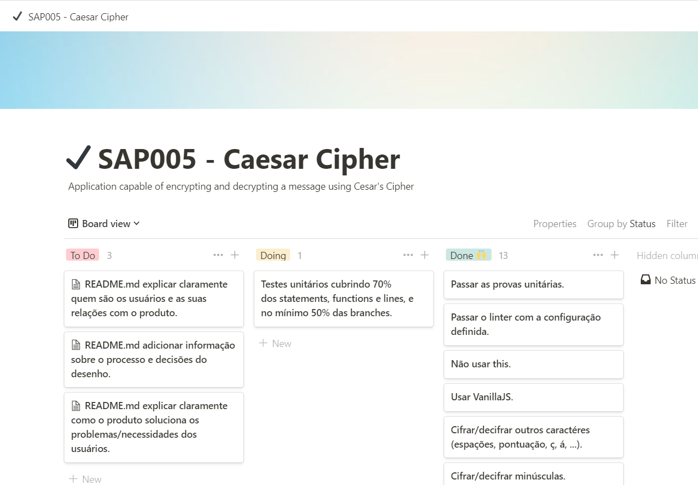
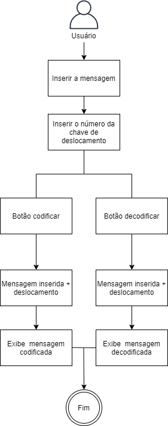
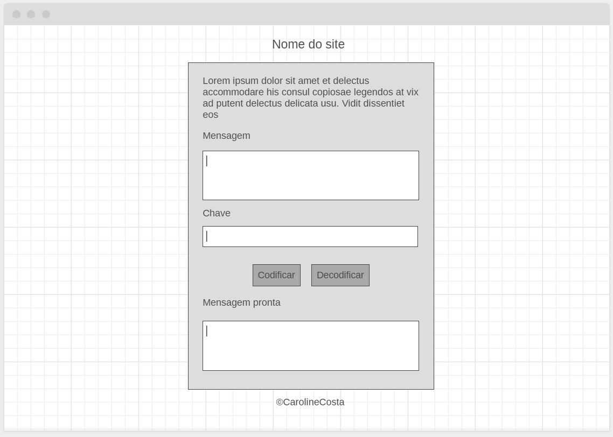
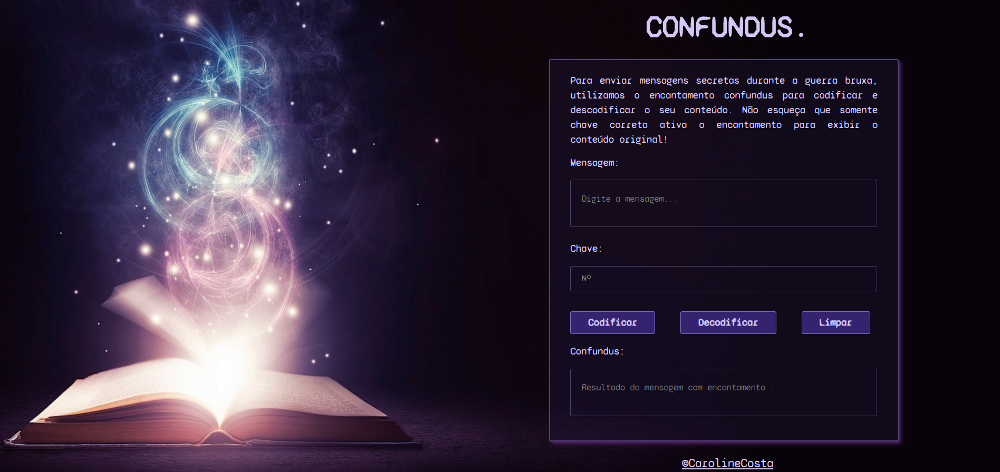
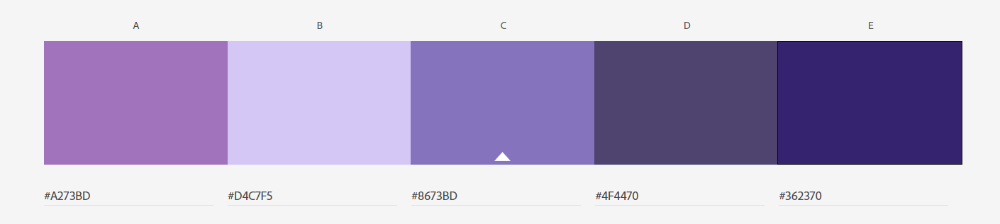

# Confundus.

Desenvolvido para enviar mensagens secretas!

## Índice

* [1. Introdução](#1-introdução)
* [2. Como utilizar](#2-como-utilizar)
* [3. Tema](#3-tema)
* [4. Identificação do usuário](#4-identificação-do-usuário)
* [5. Processo de criação](#5-processo-de-criação)
* [6. Desenvolvimento](#6-desenvolvimento)

***

## 1. Introdução

 A proposta era desenvolver uma aplicação que fosse capaz de cifrar e decifrar uma mensagem utilizando a Cifra de César, que é um tipo de cifra por substituição, em que cada letra do texto original é substituída por outra que se encontra há um número fixo de posições.

## 2. Como utilizar

✨ Para acessar a aplicação [Clique aqui!](https://carolinescosta.github.io/SAP005-cipher/index.html) ✨

📌 Codificar:

* Digite a mensagem
* Digite o número da chave de deslocamento
* Clique no botão codificar
* Copie a mensagem e faça bom uso!

📌 Decodificar:
* Digite a mensagem já codificada
* Digite o número da chave de deslocamento utilizado para codificar
* Clique no botão decodificar
* A mensagem original será exibida!

## 3. Tema

 Confundus é um encantamento que confunde e altera o alvo.
 Funciona em coisas vivas e inanimadas. Existem vários graus de confusão que podem ser causados ​​por ele indo do desconhecimento da situação atual, esquecendo informações importantes ou tornando-se particularmente impressionáveis.

## 4.Identificação do usuário

 Destinado a bruxos que querem se comunicar através de mensagens durante a guerra bruxa sem que sejam descobertos.

## 5. Processo

 📌 Organização

 Toda a organização das tarefas e processos foram realizadas utlizando o modelo de Kanban.

 

 📌 Fluxograma

 Foi feito um fluxograma pensando na experiência do usuário e para melhor entendimento dos processos da aplicação.

 

 📌 Interface

 O principal objetivo foi desenvolver uma interface em que fossem exibidas apenas as funcionalidades necessárias de forma simples e amigável ao usuário.

 * Wireframe inicial

* Interface final

 
 📌 Palheta de cores

 Depois de selecionar o background que estivesse de acordo com o tema, foi desenvolvida uma palheta de cores para criar uma harmonia visual.
 

 ## 6. Desenvolvimento

 📌 Para esse projeto foram usados:

* CSS
* HTML
* Vanilla JavaScript